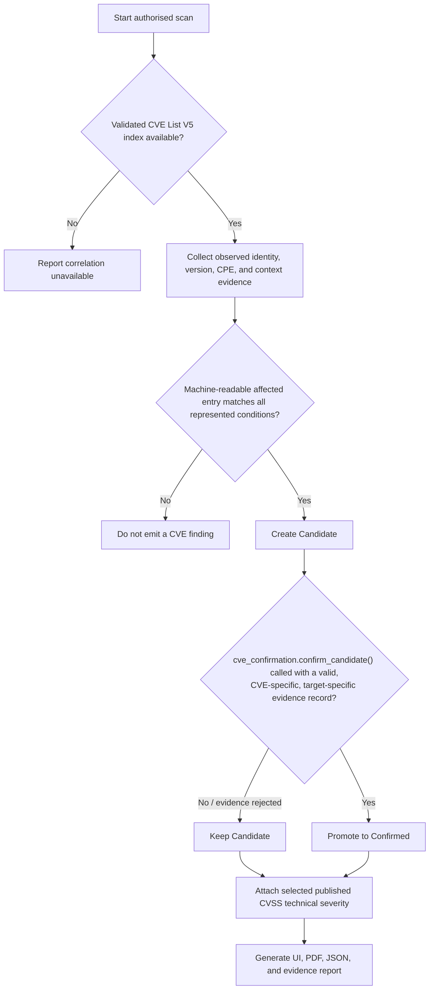

# Vulnerability Assessment, Scanning, CVE & Scoring — Standards Alignment

Scope: `scanners/`, the recon/CVE/scoring policy files under `policies/`, and
the CVE sync scripts under `scripts/`. This document does not describe
exploitation, MITRE ATT&CK technique mapping, CALDERA, or AI advisory
behaviour, which are owned by other modules of this project.

## Standards this module follows

- **CVE identifiers and affected-version data**: CVE Record Format 5.x, via
  the official `CVEProject/cvelistV5` repository. The local index
  (`scripts/rebuild_mitre_cve_index.py`) is built directly from that source;
  no vendor advisory feed, NVD API, or private CVE database is used.
- **Product identity**: directly observed service data and CPE 2.3 / legacy
  CPE URI components when present. No private product-alias table or
  similarity score participates in matching (`scanners/cve_v5_matcher.py`).
- **Version applicability**: the CVE List V5 selection algorithm.
  Exact-version rules use equality; ranged rules are evaluated only when the
  record names a supported comparison semantics (currently `semver`), and
  `changes` entries are applied in version order, not JSON source order.
  Unsupported comparison types produce no finding rather than a guess.
- **Severity**: the exact published, operator-selected CVSS v3.1 or v4.0
  Base metric (`scanners/scoring_policy.py`), validated against the FIRST
  specification. CVSS is technical severity only; it never determines finding
  status, and this module never generates, estimates, converts, or
  cross-version-substitutes a score.
- **Validation practice**: target-specific technical verification, in the
  sense used by NIST SP 800-115 (identification vs. verification of a
  vulnerable condition are distinct activities). This module identifies
  candidates; verifying exploitability of a specific CVE is a separate
  activity outside this module's scope (see *Finding contract* below).

## Finding contract: Candidate and Confirmed

The scanner emits only two CVE finding values:

- **Candidate** — observed identity, version, and every represented
  applicability constraint on a CVE List V5 affected entry match directly.
  This is a statement about applicability, not about verified
  exploitability. Produced by `scanners/cve_v5_matcher.py::search`.
- **Confirmed** — a Candidate that has been promoted through the gate in
  `scanners/cve_confirmation.py::confirm_candidate`, which requires an
  explicit, CVE-specific, target-specific validation record: the exact CVE
  ID, host, and port, a named validation method, a positive result, an
  evidence reference, and the validator that produced it. Generic scanner
  evidence — a service banner, a TLS handshake, a version string, a protocol
  probe, a CVSS score, or a cross-tool fingerprint confidence score — is
  explicitly rejected by the gate and can never satisfy it on its own,
  because none of those test the specific vulnerable behaviour a CVE
  describes.

**Current status**: no per-CVE validator exists anywhere in this project
yet. Every CVE finding this module produces today is therefore `Candidate`.
That is the honest, standards-defensible state: CVE List V5 does not publish
machine-readable exploit-detection signatures, and inventing generic
"probably exploitable" heuristics would not be backed by any of the
standards above. Building a genuine per-CVE validator is future work,
likely belonging to the exploitation/validation module, and must go through
the gate above rather than setting a `Confirmed` string directly — the
scanner's own classification logic
(`scanners/enumerator.py::_classify_cve_match`) refuses to trust a bare
`Confirmed` string that isn't backed by a gate-valid evidence record.

## Prohibited inputs

No Candidate or Confirmed finding may be created from:

- CVE description keyword or prose matching;
- hardcoded CVE identifiers, product aliases, version facts, platforms,
  ports, targets, or validation results;
- string containment or similarity;
- a private confidence score (including service-fingerprint consensus
  confidence — see `scanners/fingerprint_validator.py`, which only ever
  influences *which* observed product/version string is searched, never
  whether a match is classified Candidate or Confirmed);
- CVSS score or severity;
- a downstream AI, mapping, exploitation, or CALDERA guess (enforced at the
  integration boundary — see `vulnerability_scanning_integration.md`).

## Singapore context

This module's standards (CVE, FIRST CVSS v3.1/v4.0, NIST SP 800-115) are the
same internationally-recognised baselines referenced by Singapore's
Cyber Security Agency (CSA). Penetration testing is a licensable service
category under Singapore's Cybersecurity Act 2018's licensing framework for
cybersecurity service providers, administered by CSA. This is noted here as
alignment context for a Singapore-based engagement; it does not change any
runtime behaviour of this module, and this document does not constitute
legal or licensing advice — engagement-specific licensing and compliance
requirements should be confirmed directly against CSA's current published
guidance.

## Known structural limitation

`scanners/enumerator.py::run_pipeline` is a large (~1,150-line) orchestration
function covering discovery, fingerprinting, active validation, CVE
matching, and report assembly in one function, with several nested closures
and thread-local scan-context handling for its concurrent port-discovery
stage. It works correctly and was left as-is deliberately: decomposing it
safely requires the ability to run this project's test suite end-to-end
(`scanners/tests/`), which was not possible in the environment this pass of
work was done in. A future pass with real test execution (on the Kali
target environment) should split it into named stage functions (discovery,
fingerprinting, active-validation, CVE-matching, report-assembly), verifying
each extraction against the existing test suite before moving to the next.
